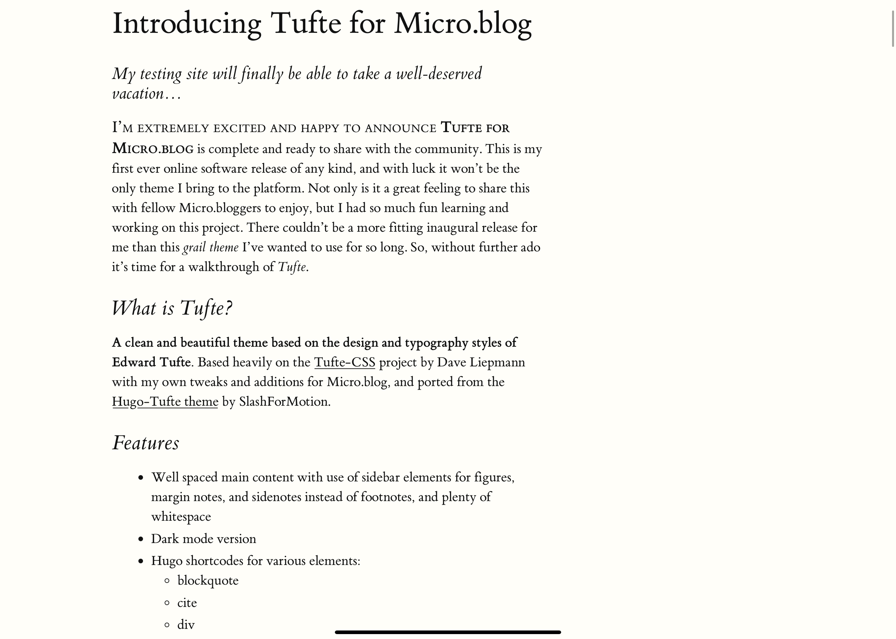
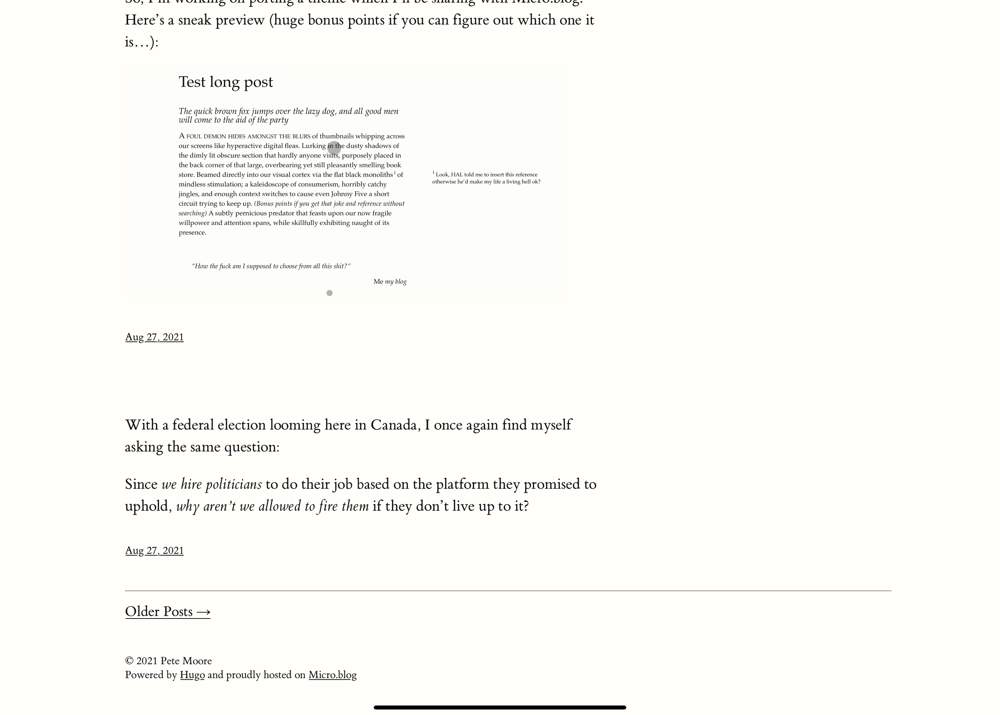
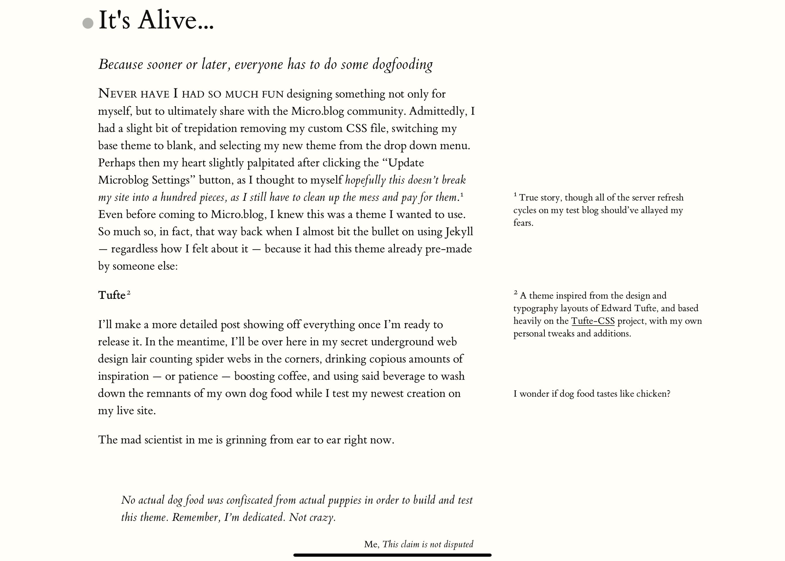
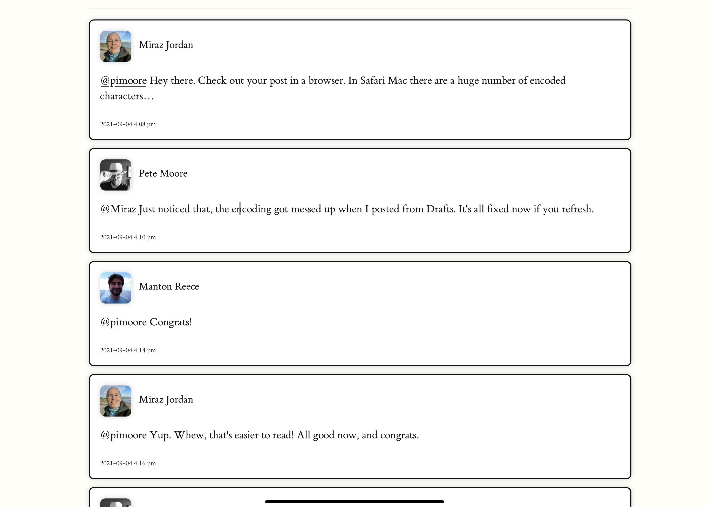
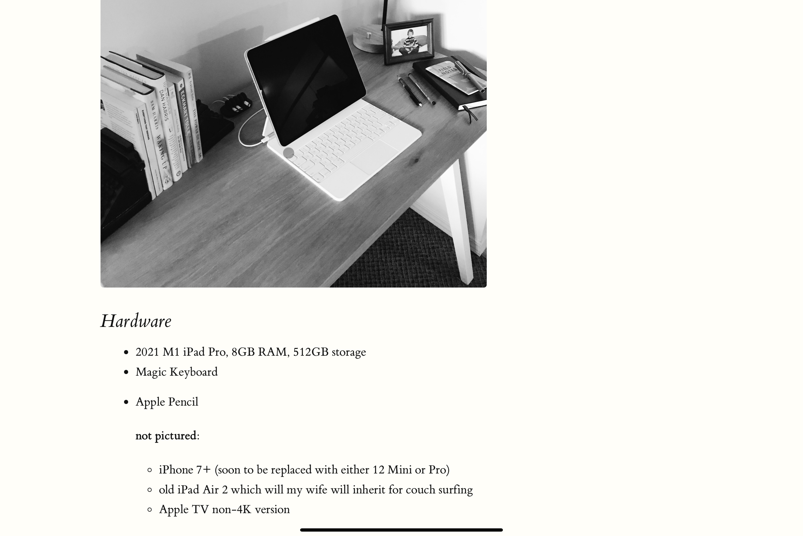
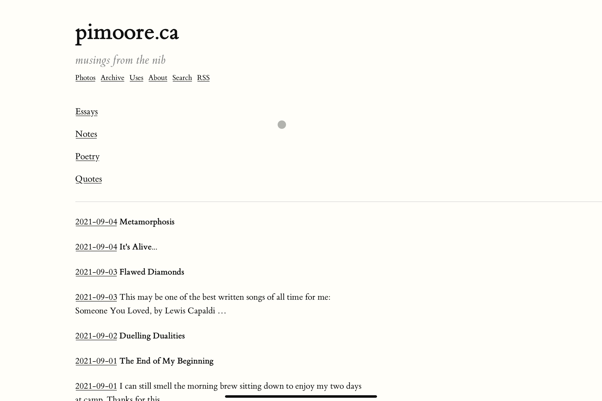
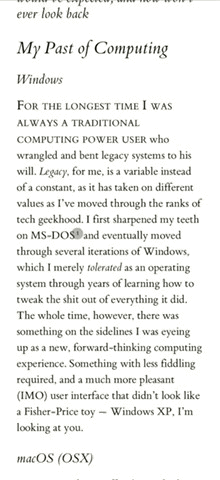

# Practical Tufte

A typography-focused theme for [Micro.blog](https://micro.blog), inspired by Matthew Butterick's [Practical Typography](https://practicaltypography.com/) and built on top of [Tufte for Micro.blog](https://github.com/pimoore/microdotblog-tufte) by Pete Moore.

It combines the Tufte tradition of sidenotes and margin notes with the clean, considered typographic style of Practical Typography: a three-column layout with post metadata on the left, body text in the centre, and sidenotes in the right margin.

## Features

- **Three-column layout** with left metadata (title and date), body text, and a right margin for sidenotes and figures
- **Paragraph anchors** -- every paragraph and heading gets a subtle `#` permalink (hidden until hover on desktop, always visible on mobile), inspired by [Scripting.com](http://scripting.com/)
- **Dark mode** with full coverage across all elements
- **Responsive design** that collapses gracefully to a single column on mobile, with tappable sidenote/marginnote toggles
- **Archive page** grouped by year and month, showing only titled posts
- **Larger body text for untitled posts** -- short-form posts without a title are displayed in a slightly larger font
- Link styling that distinguishes visited from unvisited links (underline vs. degree symbol)
- Circled ordered list numbers inspired by Practical Typography
- Full support for Micro.blog conversations, categories, and plugin architecture
- Hugo shortcodes for rich typographic elements:
  - `blockquote` / `epigraph`
  - `cite`
  - `div` / `section`
  - `figure` (regular, full-width, and margin)
  - `marginnote` / `sidenote`
  - `newthought`
  - `summary`
  - `poetry`

## Shortcode Usage

All shortcodes use the standard Hugo syntax: `` to open and `` to close. Some accept parameters in addition to inner content.

**Ulysses users:** wrap shortcodes with tildes (`~`) on each end so the app treats them as raw source. Credit to @moondeer on Micro.blog for this tip.

### Blockquote and Epigraph

`blockquote` is a shortcode alternative to Markdown's `>` syntax, with support for attribution:

| Parameter | Description |
|-----------|-------------|
| `pre` | Author name |
| `cite` | Source title |
| `link` | Source URL (omit the `http(s):` prefix -- use `//example.com/path/`) |
| `post` | Trailing text after the citation (e.g. page numbers) |

`epigraph` accepts the same parameters but renders in smaller italic text. Use it for highlighted passages or pull-quotes at the start of an article.

```

Quote text here.

```

### Cite

Formats text as a standalone citation in smaller italics.

```
Citation text
```

### Div and Section

Shortcodes for `<div>` and `<section>` blocks with optional `class` and `id` parameters. Close with ``.

```

Block content here.

```

### Figure

Inserts figures in three formats:

| Type | Description |
|------|-------------|
| *(default)* | Same width as body text |
| `full` | Full width including the margin |
| `margin` | Placed in the margin as a marginnote |

Parameters: `src`, `alt`, `type`, `title`, `caption`, `label` (required for margin toggle), `attr`, `attrlink`.

```

```

### Sidenote and Marginnote

Both place notes in the right margin. Sidenotes add sequential superscript numbers (like footnotes); marginnotes do not.

```
Sidenote text.
Marginnote text.
```

### Newthought

Renders a span of small-caps text, typically used to mark the start of a new section.

```
Opening words followed by regular text.
```

### Summary

Adds a synopsis to longer articles. Used with Hugo's `<!--more-->` divider to show only the summary on the index page.

```
# Post Title

Summary text shown on the index page.<!--more-->

Full post content starts here.
```

### Poetry

Maintains line breaks and indentation for poetry formatting. The text is placed in a code block but styled to match the body font, with word wrapping at whitespace boundaries.

```

Now is the time
    for all good men
        to come to the aid of the party

```

## URL Slug Control

Micro.blog generates URL slugs from the first three words of a post's title or text. If a short-form post starts with a shortcode (e.g. `epigraph` or `poetry`), the shortcode name can end up in the slug. To control this, add a hidden paragraph before the shortcode:

```
<p hidden>desired slug words</p>
Quote text.
```

Note: Micro.blog still uses only the first three words.

## Built-in Plugin Support

Practical Tufte includes layout and styling support for the following Micro.blog plugins. They work automatically when installed:

- **Reply by Email** by @sod -- adds a reply-via-email link to each post
- **Conversation on Micro.blog** by @sod -- adds a reply-via-Micro.blog link to each post
- **Surprise Me!** by @sod -- adds a link in the navigation menu
- **Post Stats** by @amit -- adds a link in the navigation menu to its stats page

## On This Day Support

Based on the plugin by @cleverdevil. To set it up, create a new page titled "On This Day", add it to your navigation, and paste the following code into its content:

```html
<div id="on-this-day">
  <div class="center">Loading...</div>
</div>

<script>
var container = document.getElementById('on-this-day');

function renderPost(post) {
    var postEl = document.createElement('article');
    postEl.className = 'post h-entry';
    container.appendChild(postEl);

    if (post['properties']['name'] != null) {
        var dividedEl = document.createElement('div');
        dividedEl.className = 'divided';
        postEl.appendChild(dividedEl);
        var titleEl = document.createElement('h1');
        titleEl.className = 'content-title';
        titleEl.innerText = post['properties']['name'][0];
        dividedEl.appendChild(titleEl);
    }

    var contentEl = document.createElement('section');
    contentEl.className = 'post-content e-content';
    contentEl.innerHTML = post['properties']['content'][0]['html'];
    postEl.appendChild(contentEl);

    var postmetaEl = document.createElement('div');
    postmetaEl.className = 'post-meta';
    contentEl.appendChild(postmetaEl);

    var postdateEl = document.createElement('div');
    postdateEl.className = 'article-post-date';
    postmetaEl.appendChild(postdateEl);

    var permalinkEl = document.createElement('a');
    permalinkEl.className = 'permalink u-url';
    permalinkEl.href = post['properties']['url'][0];
    postdateEl.appendChild(permalinkEl);

    var publishedEl = document.createElement('time');
    publishedEl.className = 'dt-published';
    publishedEl.datetime = post['properties']['published'][0];

    var published = post['properties']['published'][0];
    published = new Date(published.slice(0,19).replace(' ', 'T'));

    publishedEl.innerText = published.toDateString();
    permalinkEl.appendChild(publishedEl);

    var ruleEl = document.createElement('hr');
    container.appendChild(ruleEl);
}

function renderNoContent() {
    var noPostsEl = document.createElement('div');
    noPostsEl.className = 'center';
    noPostsEl.innerText = 'No posts found for this day. Check back tomorrow!';
    container.appendChild(noPostsEl);
}

var xhr = new XMLHttpRequest();
xhr.responseType = "json";
xhr.open('GET', "https://micromemories.cleverdevil.io/posts?tz=America/Toronto", true);
xhr.send();

xhr.onreadystatechange = function(e) {
    if (xhr.readyState == 4 && xhr.status == 200) {
        container.innerHTML = '';
        if (xhr.response.length == 0) {
            renderNoContent();
        } else {
            xhr.response.forEach(function(post) {
                renderPost(post);
            });
        }
    }
}
</script>
```

**Important:** change the timezone parameter (`tz=America/Toronto`) to your own timezone.

## Installing the Theme

Practical Tufte is available as a plugin on Micro.blog.

Before installing, remove any custom CSS and other theme plugins, and set your design template to **Blank**. Save, then install the Practical Tufte plugin. If anything doesn't display correctly, try removing all plugins first, installing Practical Tufte, then re-adding your other plugins.

### Configuration

Once installed, you can set the following in the plugin settings:

- **Subtitle** -- displayed below your site title
- **Description** -- used in meta tags for SEO

## Screenshots

### Index




### Post Page



### Micro.blog Conversation



### Content Page



### Archive



### Mobile Sidenote/Marginnote Expansion

On smaller screens, sidenotes and marginnotes collapse into tappable toggles. Sidenotes use their superscript number; marginnotes and margin figures show a circled plus symbol.



## Credits

Practical Tufte builds on the work of:

- **Pete Moore** ([@pimoore](https://github.com/pimoore)) -- [Tufte for Micro.blog](https://github.com/pimoore/microdotblog-tufte), the theme this project is based on
- **Dave Liepmann** -- [Tufte-CSS](https://github.com/edwardtufte/tufte-css/), the original CSS framework for Tufte-style web typography
- **SlashForMotion** -- [Hugo-Tufte](https://github.com/slashformotion/hugo-tufte), the Hugo port that Tufte for Micro.blog was built from
- **Matthew Butterick** -- [Practical Typography](https://practicaltypography.com/), whose design principles and typographic style inspired the layout and visual direction of this theme
- **Leon Paternoster** (@leonp on Micro.blog) -- posts on font spacing, typography, and legibility
- **Jason Cardwell** (@moondeer on Micro.blog) -- Ulysses shortcode tip
- **Manton Reece** (@manton on Micro.blog) -- creator of the Micro.blog platform

## License

Licensed under the MIT License. See [LICENSE.md](LICENSE.md) for details.
